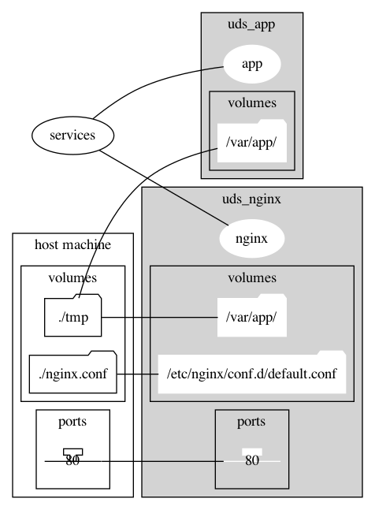

# yaml-visualizer

This tool visualize resources defined by `docker-compose.yml`.

- `services`
- `volumes`
- `resources`

# Requirement

- [graphviz](https://graphviz.org/)

We use Graphviz which is open source graph visualization software to visualize resources.
And we use Graphviz installation of your system to save and render graph.
Please install Graphviz in your system.


# Install

```sh
pip install git+https://github.com/wf-yamaday/yaml-visualizer
```

# Usage

```sh
$ yaml-viz -h
usage: yaml-viz [-h] [-i INPUT] [-o OUTPUT]

optional arguments:
  -h, --help            show this help message and exit
  -i INPUT, --input INPUT
                        input filename. default: ./docker-compose.yml
  -o OUTPUT, --output OUTPUT
                        output filename. default: output-YYYYmmdd-HHMMSS.png
```

# Example

## Input

The following is a sample docker-compose.yml file.

```yaml
version: '3.7'

services:

  app:
    container_name: uds_app
    build:
      context: .
      dockerfile: ./Dockerfile
    volumes:
      - ./tmp:/var/app/
    tty: true

  nginx:
    container_name: uds_nginx
    image: nginx
    volumes:
      - ./tmp:/var/app/
      - ./nginx.conf:/etc/nginx/conf.d/default.conf
    ports:
      - 80:80
    tty: true

```

```sh
$ yaml-biz -i docker-compose.yml -o sample
```

## Output

Output as sample.png.


