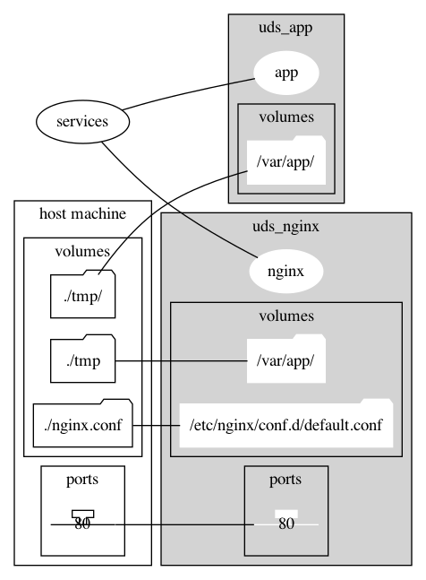

# yaml-visualizer

This tool visualize resources defined by `docker-compose.yml`.

# usage

```sh
python main.py ./docker-compose.yml
```

## setup

- python > version 3.7
- graphviz
- docker-compose.yml > version 3

```sh
# for macOS
brew install graphviz
pip3 install -r requirements.txt
```

# sample

## input

```yaml
version: '3.7'

services:

  app:
    container_name: uds_app
    build:
      context: .
      dockerfile: ./Dockerfile
    volumes:
      - ./tmp/:/var/app/
    tty: true

  nginx:
    container_name: uds_nginx
    image: nginx
    volumes:
      - ./tmp:/var/app/
      - ./nginx.conf:/etc/nginx/conf.d/default.conf
    ports:
      - 80:80
    tty: true

```

## output


